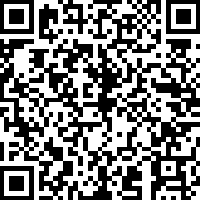
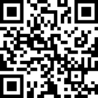
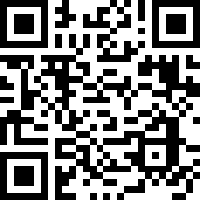

Mirror of donation info on [my website](https://twester.tk/ssg/donations.html)

Any and all donations are very much appreciated, but no one should ever feel obligated to donate.  
There are multiple ways in which you can donate:  

For traditional-style donations,  
<blockquote>
You can <a href="https://buymeacoffee.com/user1813081420">buy me a cofee</a>
</blockquote>

Or give a direct bank transfer:
<blockquote>
Account Holder:		Thijs Wester 
IBAN:				NL10 INGB 0704 6738 00
BIC:				INGBNL2A
</blockquote>

I also accept a few crypto currencies,  

Monero 

Bitcoin 

Etherium 

Monero: 
47N5XkfsNqPj4QPeMML87P8zytY6CAW6Fb1Qpx8No3wzip3K4W3Uoqmcs4ivufbY75Su4DrNMmzGqgz6xbfuXnpq5xZvDXK
 
 
Bitcoin: 
35rY4muKcD9pooSKu5DouZtS8wVnr15U7o
 
 
Etherium: 
0xEa7958f01BEF448D14c63b30bedA6B184B3dF6AA

Lastly, I accept Brave Basic Attention Tokens (BAT).
